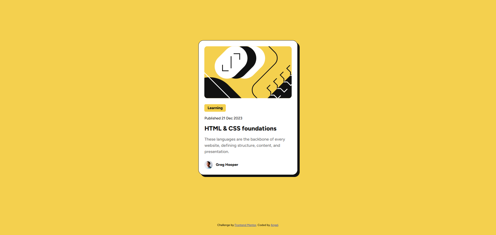

# 📖 Frontend Mentor - Solución del reto Blog preview card

Esta es mi solución al reto [Blog preview card en Frontend Mentor](https://www.frontendmentor.io/challenges/blog-preview-card-ckPaj01IcS).

## Tabla de contenidos

- [Resumen](#resumen)
  - [El reto](#el-reto)
  - [Captura de pantalla](#captura-de-pantalla)
  - [Enlaces](#enlaces)
- [Mi proceso](#mi-proceso)
  - [Construido con](#construido-con)
  - [Lo que aprendí](#lo-que-aprendí)
  - [Desarrollo continuo](#desarrollo-continuo)
  - [Recursos útiles](#recursos-útiles)
- [Autor](#autor)
- [Agradecimientos](#agradecimientos)

## 💻 Resumen

### El reto

Los usuarios deberían poder:

- Ver los estados de hover y focus en todos los elementos interactivos de la página

### Captura de pantalla



### Enlaces

- URL de la solución: https://github.com/angeldavid04/blog-preview-card
- URL del sitio en vivo: https://angeldavid04.github.io/blog-preview-card/

## 💪 Mi proceso

### Construido con

- HTML5 semántico
- Propiedades personalizadas de CSS
- Flexbox

### Lo que aprendí

Mejoré mis habilidades con flexbox y el diseño de layouts en HTML & CSS. Más que nada repasé el uso de alineación de elementos.

Tambíen aprendí una forma de hacer una transición simple con pseudoelementos y transform.

Practiqué el marcado semántico en la creación del elemento de carta decidiendo que elementos eran los más adecuados para cada parte del componente.

```html
<article class="card">
  
  <div class="card__body">
    <span class="card__badge">Learning</span>
    <time datetime="2023-12-21" class="card__date">Published 21 Dec 2023</time>
    <h1 class="card__title">HTML & CSS foundations</h1>
    <p class="card__content">
      These languages are the backbone of every website, defining structure,
      content, and presentation.
    </p>
  </div>
  <div class="card__footer">
    
    <p class="card__author">Greg Hooper</p>
  </div>
</article>
```

También, encontré la forma de acomodar los elementos dentro de la carta de tal forma que usaran todo el espacio disponible con la propiedad flex.

```css
/* Ejemplo */
.card__body {
  display: flex;
  flex-direction: column;
  gap: 1rem;
  flex: 1;
}
```

### Desarrollo continuo

Me gustaría perfeccionar mi dominio sobre flexbox y el marcado HTML para poder hacer páginas web accesibles y usables.
Observé que el gap de flexbox puede ser útil para organizar elementos, sin embargo me gustaría conocer a profundidad las distintas técnicas de organización de elementos, con el objetivo de discernir entre una y otra para escoger la más adecuada según la situación.
También me gustaría mejorar en la optimización de código CSS para hacer proyectos escalables.

### Recursos útiles

- [MDN Web Docs](https://developer.mozilla.org/es/) - Este recurso es muy bueno y me ayuda sobre todo a escoger funciones y características que funcionan en cualquier navegador.

## 🤓 Autor

- Frontend Mentor - [Angel López](https://www.frontendmentor.io/profile/AngelDavid-dev)

## ♥️ Agradecimientos

Le quiero dar un agradecimiento a mi maestros del bachillerato porque sin ellos no fuera quien soy ahora, JonMircha por ser un gran docente digital y enseñarme los fundamentos del desarrollo web, y a Lucas Dalto por ofrecerme muy buenos cursos para aprender y repasar.
